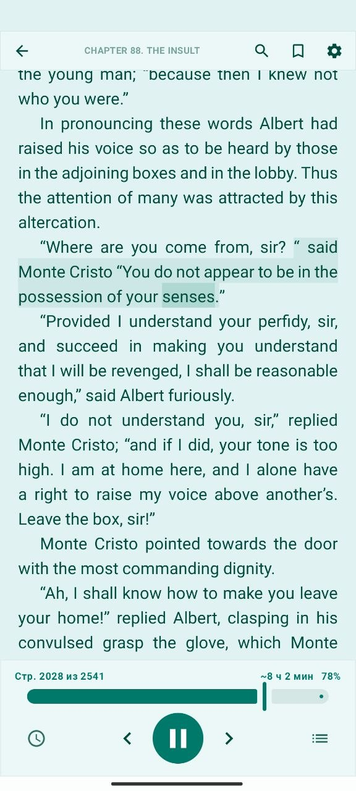
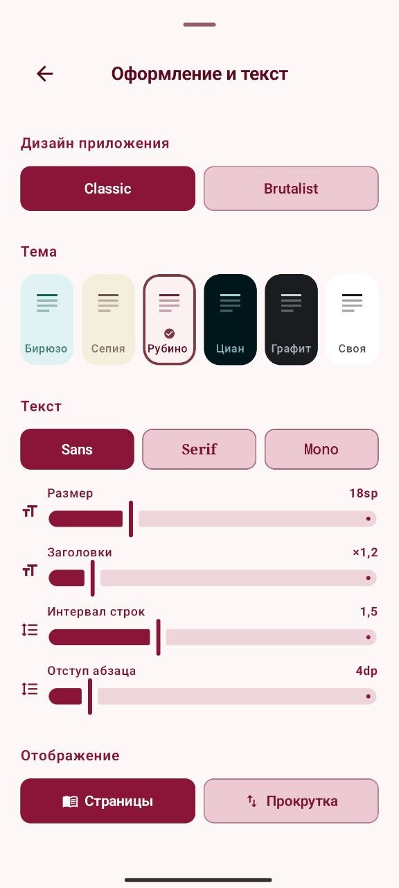
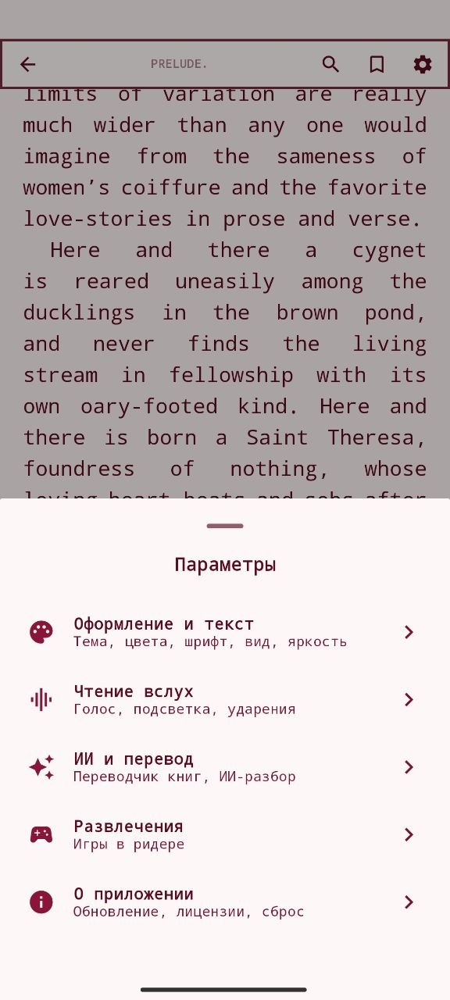
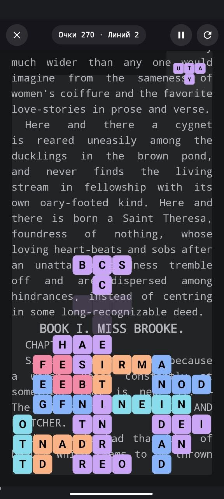

# Reciter

Android-приложение для чтения электронных книг с озвучиванием голосом.

[**→ Скачать последнюю версию**](../../releases/latest)

## Скриншоты

<!-- Скриншоты кладите в папку screenshots/ этого репозитория с этими именами
     (портрет, .png). Пустые слоты просто не отобразятся, пока нет файла. -->

<table>
  <tr>
    <td width="33%" align="center"> Библиотека</td>
    <td width="33%" align="center"> Читалка</td>
    <td width="33%" align="center"> Озвучка с подсветкой</td>
  </tr>
  <tr>
    <td width="33%" align="center"> Темы и оформление</td>
    <td width="33%" align="center"> Параметры</td>
    <td width="33%" align="center"> Мини-игра во время прослушивания</td>
  </tr>
</table>

## Установка

1. Скачайте `.apk` со страницы [Releases](../../releases/latest).
2. Откройте файл на телефоне — Android попросит разрешение установить из неизвестного источника. Разрешите однократно для браузера или файлового менеджера.
3. Готово. Дальнейшие обновления приложение скачивает само (Настройки → «Проверить обновления»).

**Требования:** Android 7.0+, ≈150 МБ свободного места.

## Возможности

**Чтение и формат**
- Форматы: FB2 (включая `.fb2.zip`) и EPUB.
- Две дизайн-системы — Classic (мягкие формы) и Brutalist (моноширинный шрифт, острые углы).
- Темы: Бирюза, Сепия, Циан, Графит, Рубин + пользовательские цвета.
- Настройка размера шрифта, межстрочного, отступов, переноса слов.

**Озвучивание (TTS)**
- Системный голос Android: скорость, тон, голос, паузы между абзацами.
- Подсветка читаемого слова, пауза при сворачивании, продолжение с того же места.
- Офлайн-словарь ударений + собственный словарь произношения (замены слов, ударения, ё/е).
- **Свой голосовой сервер** — можно подключить собственный TTS с клонированием голоса (см. ниже).

**Библиотека и контент**
- Серии, шкафы, закладки, оглавление, сортировка, поиск, фильтры по статусу.
- ИИ-разбор глав и абзацев — улучшает структуру плохо размеченных книг.
- Переводчик книг ru↔en офлайн на устройстве.

**Облако**
- Синхронизация прогресса и библиотеки через Google Drive или Яндекс.Диск.
- Раздельное хранение данных по аккаунту.

**Дополнительно**
- Таймер сна, автояркость.
- Мини-игры в читалке во время прослушивания: словесная змейка, лопни букву и другие.

## Свой голосовой сервер (для продвинутых)

Хотите слушать книги собственным голосом или качественной нейромоделью? Можно
поднять свой TTS-сервер на домашнем ПК с видеокартой и подключить его в
приложении. Готовые комплекты (Docker) для нескольких движков и инструкция — в
папке [`reciter-tts/`](reciter-tts/).

## Обратная связь

Вопросы и сообщения об ошибках — через [Issues](../../issues).
