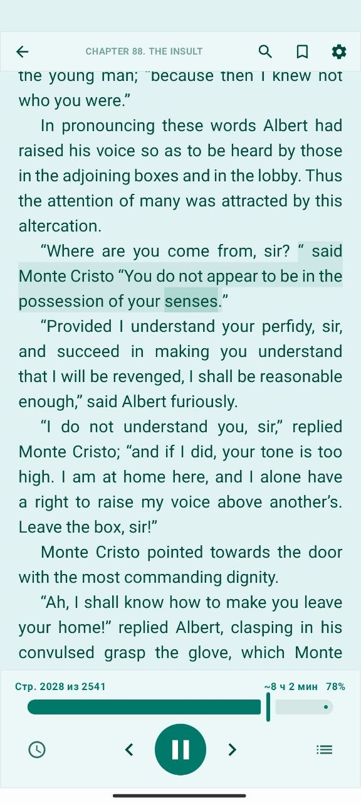
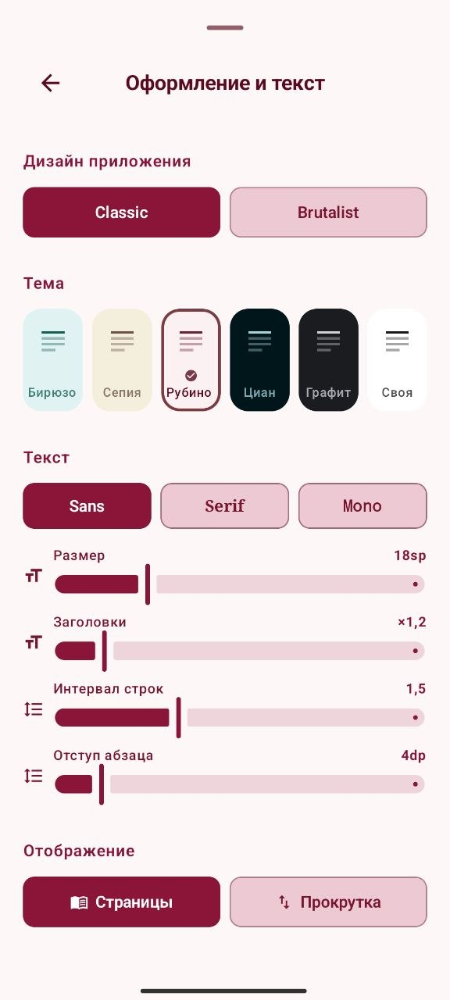
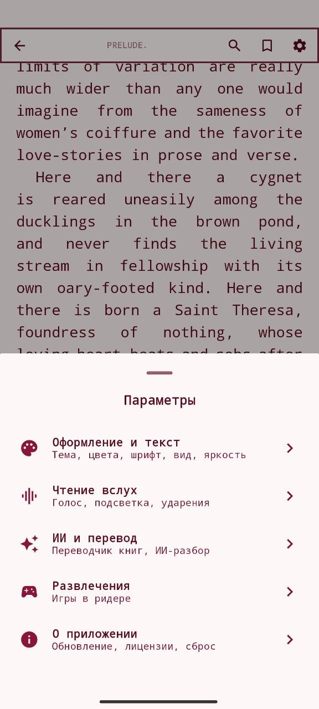
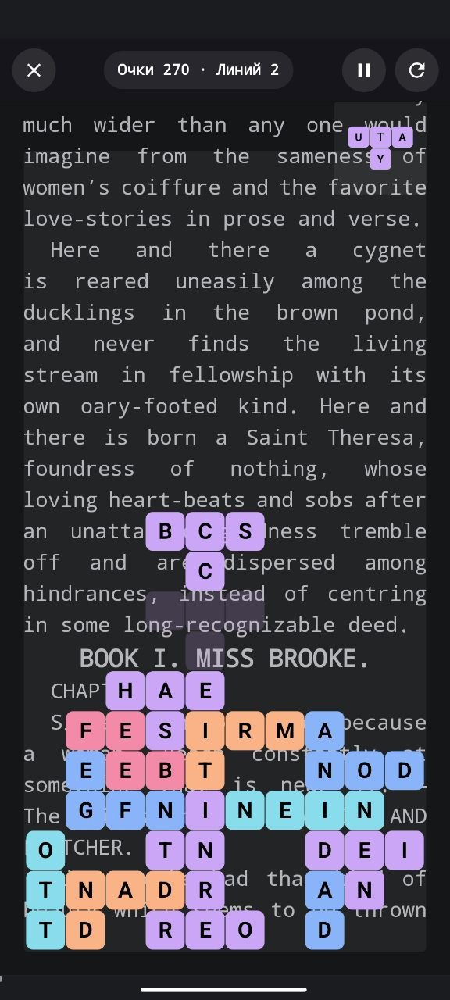

# Reciter Книги

Android-приложение для чтения и прослушивания электронных книг.

[**→ Скачать последнюю версию**](../../releases/latest)

## Скриншоты

<!-- Скриншоты кладите в папку screenshots/ этого репозитория с этими именами
     (портрет, .jpg). Пустые слоты просто не отобразятся, пока нет файла. -->

<table>
  <tr>
    <td width="33%" align="center"> Библиотека</td>
    <td width="33%" align="center"> Читалка</td>
    <td width="33%" align="center"> Озвучка с подсветкой</td>
  </tr>
  <tr>
    <td width="33%" align="center"> Темы и оформление</td>
    <td width="33%" align="center"> Параметры</td>
    <td width="33%" align="center"> Мини-игра во время прослушивания</td>
  </tr>
</table>

## Установка

1. Скачайте `.apk` со страницы [Releases](../../releases/latest).
2. Откройте файл на телефоне — Android попросит разрешение установить из неизвестного источника. Разрешите однократно для браузера или файлового менеджера.
3. Готово. О новых версиях приложение сообщает само при запуске и предлагает обновиться.

**Требования:** Android 7.0+, ≈150 МБ свободного места.

История изменений — в файле [`CHANGELOG.md`](CHANGELOG.md).

## Возможности

**Синхронизация через ваше облако**
- Хранение книг и прогресса чтения в вашем личном облаке — Google Диск или Яндекс.Диск.
- Раздельное хранение данных разных аккаунтов.
- Работа без интернета: библиотека, чтение и озвучка остаются на устройстве.

**Чтение с нескольких устройств**
- Продолжение чтения ровно с того места, где вы остановились, на любом устройстве под одним аккаунтом.
- Виджет «Продолжить чтение» на рабочем столе: обложки недочитанных книг и следующих томов начатых серий; работает и при закрытом приложении, и без сети.

**Умная библиотека**
- Добавление книг из памяти телефона — в облако они уезжают сами.
- Автоматическая группировка по авторам и сериям с нумерацией томов.
- Ручное объединение автора и серии, когда написание из разных источников разошлось.
- Шкафы, закладки, оглавление, сортировка, поиск, фильтры по статусу.
- Восстановление оглавления, сносок, иллюстраций и шапки «автор — название» там, где в файле нет разметки; примечания списком в конце книги становятся обычными сносками.

**Озвучка и настройка под себя**
- Системный голос Android: скорость, тон, выбор голоса, паузы между абзацами.
- Подсветка читаемого слова, пауза при сворачивании, продолжение с того же места.
- Чтение сносок по ходу озвучки — без произнесения их номеров.
- Раздельное запоминание голоса для русских и английских книг.
- Офлайн-словарь ударений и собственный словарь произношения (замены слов, ударения, ё/е).
- Подключение собственного сервера озвучки, в том числе с клонированием голоса (см. ниже).

**Переводчик и разбор глав**
- Офлайн-перевод книг с русского на английский и обратно, на самом устройстве.
- Умный разбор глав для плохо размеченных книг — тоже на устройстве.

**Внешний вид и отдых**
- Две дизайн-системы — Classic (мягкие формы) и Brutalist (моноширинный шрифт, острые углы).
- Набор тем читалки и свои цвета; размер шрифта, межстрочный интервал, отступы, перенос слов.
- Готовые темы оформления и поддержка собственных — подробнее ниже.
- Свои шрифты `.ttf` и `.otf` отдельно для текста книги и для интерфейса; хранятся в вашем облаке, поэтому доступны на всех устройствах.
- Мини-игры прямо в читалке: «Словесная змейка», «Лопни букву» и другие.
- Таймер сна и автояркость.

**Форматы**
- FB2 (включая `.fb2.zip`) и EPUB.

## Темы оформления

Тема меняет приложение целиком: палитру, шрифты, форму панелей, плотность
списка книг, картинки под фоном и панелями, вид страницы книги и даже значки
кнопок.

**Как поставить.** «Параметры → Темы» — карточка показывает, как тема выглядит,
кнопка рядом её скачивает, нажатие на карточку применяет. Тема хранится в этом
репозитории (папка [`themes/`](themes/)), а не внутри приложения, поэтому оно не
растёт в размере, а темы обновляются независимо от его версии.

| В репозитории | В приложении |
|---|---|
| появилась новая тема | новая карточка с кнопкой загрузки |
| тему поправили | у скачанной темы кнопка «Обновить тему» |
| тему убрали | скачанная остаётся на устройстве и работает |

Скачанная тема удаляется **с устройства**, а не насовсем: карточка вернётся с
кнопкой загрузки, и поставить её снова можно в любой момент.

**Своя тема.** Тема — обычный текстовый файл плюс картинки рядом, без
программирования. Формат описан целиком в папке
[`reciter-themes/`](reciter-themes/): палитра, скругления, шрифты, формы
панелей, свои подложки и значки, порядок элементов на экране. Готовая тема
«Шиноби» служит рабочим примером — распакуйте её архив, поменяйте цвета и
картинки, запакуйте обратно и добавьте кнопкой импорта на том же экране. Своей
темой можно поделиться файлом.

## Свой голосовой сервер (для продвинутых)

Хотите слушать книги собственным голосом или качественной нейромоделью? Можно
поднять свой TTS-сервер на домашнем ПК с видеокартой и подключить его в
приложении. Готовые комплекты (Docker) для нескольких движков и инструкция — в
папке [`reciter-tts/`](reciter-tts/).

## Обратная связь

Вопросы и сообщения об ошибках — через [Issues](../../issues).
